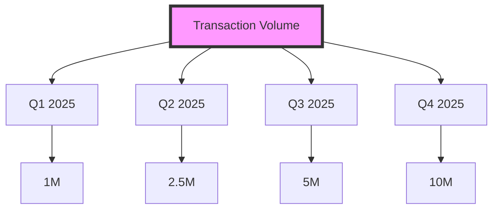

# 🔗 Equilink
### *Revolutionizing Blockchain Social Finance*


> *Bridging traditional finance with decentralized innovation*

[](https://github.com/Equilink)
[](https://github.com/Equilink)
[](https://twitter.com/equilink)

---

## 🚀 Our Mission
We're revolutionizing blockchain technology by creating an innovative platform that seamlessly integrates advanced tokenomics with social features. Our technology bridges the gap between traditional financial systems and decentralized finance while fostering a vibrant, engaged community.

## 🌟 Platform Overview
> *Where Innovation Meets Accessibility*

Equilink operates on the Binance Smart Chain (BSC), delivering a perfect balance of speed, cost-efficiency, and reliability. Our platform transforms traditional blockchain interactions into engaging, community-driven experiences.

### ⚡ Core Architecture

<div align="center">

| System | Capabilities |
|---------|-------------|
| 🏛️ **BSC Infrastructure** | High-speed transactions, cost efficiency, scalability |
| 🔐 **Security Framework** | Smart contract audits, multi-signature protocols, automated monitoring |
| 🗳️ **Governance System** | Community voting, protocol upgrades, strategic initiatives |
| 💰 **Token Economics** | Staking, liquidity provision, reward mechanisms |

</div>

### 🛠️ Technical Implementation
```typescript
const platformCore = {
  infrastructure: {
    blockchain: "Binance Smart Chain",
    performance: "High throughput",
    scaling: "Layer 2 optimization"
  },
  security: {
    smartContracts: "Regular audits",
    protocols: "Multi-signature",
    monitoring: "24/7 automated"
  },
  governance: {
    voting: "Token-weighted",
    proposals: "Community-driven",
    execution: "Automated"
  },
  tokenomics: {
    staking: "Multiple pools",
    liquidity: "Incentivized provision",
    rewards: "Performance-based"
  }
};
```

## 💫 Why Choose Equilink?

- 🚄 **High Performance**: Lightning-fast transactions
- 🔒 **Security First**: Comprehensive protection
- 💰 **Cost Efficiency**: Minimal transaction fees
- 🌍 **Sustainability**: Environmentally conscious
- 🤝 **Community Driven**: Decentralized governance
- 📈 **Growth Focused**: Continuous innovation

## 🌱 Resources & Development

- 📚 [Documentation](https://docs.equilink.finance)
- 💡 [Blog](https://blog.equilink.finance)
- 🎓 [Learning Hub](https://learn.equilink.finance)
- 🤝 [Community Forum](https://community.equilink.finance)
- 📊 [Analytics Dashboard](https://analytics.equilink.finance)

## 🎯 Development Roadmap

```ascii
2025 Q1: 🔗 Genesis Launch - Core Platform
2025 Q2: 💹 DeFi Integration - Advanced Trading
2025 Q3: 🌐 Cross-Chain - Interoperability
2025 Q4: 🚀 Ecosystem Expansion - Partner Network
```

## 📊 Performance Metrics


## 🤝 Connect With Us

- 🌐 [Website](https://equilink.finance)
- 💼 [LinkedIn](https://linkedin.com/company/equilink)
- 🐦 [Twitter](https://twitter.com/equilink)
- 📧 [Contact](mailto:hello@equilink.finance)

---

<div align="center">

### *"Connecting Finance with the Future"*

</div>

```ascii
           🔗
Building the Future of Finance
           💫
```
